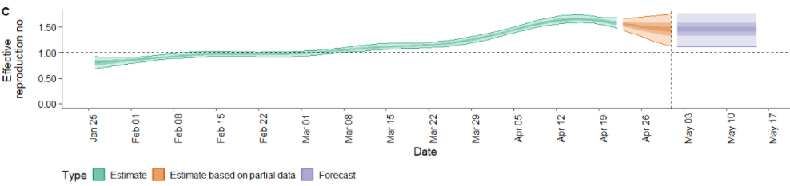

```{r setup, include=FALSE}
knitr::opts_chunk$set(
	echo = TRUE,
	message = FALSE,
	warning = FALSE
)
```

# Introduction

R number, denoted $R_t$ is the expected number of new infections caused by an infectious individual in population were some individuals may no longer be susceptible. It is generally used my policy maker to access transmission going on within community. It can be sued to monitor near real time change in transmission.

we have used the method ***Cori et al*** which are currently implemented in R package EpiNow2. The ***Cori et al*** method estimates the instantaneous rather than the case reproductive number and is conceptually appropriate for near real-time estimation. the method uses minimal parametric assumptions about the underlying epidemic process and can accurately estimate abrupt changes in the instantaneous reproductive number using data.

# Data

We used data from the github repository of the john hopkins univeristy. it is open-source data repository that contains UpToDate data for new case, death and recovered. we have used data from our world is data too.

we have directly imported the data into our analysis using R programming. then we filtered the data for nepal and for comparison purpose , we did same for india too.

further, we filter out all the data that are less then 50 from the cumulative daily cases as estimation of R number would likely be inaccurate because large proportion of these cases involve transmission outside the population.

as we want to produce the R number for the second wave of the covid 19, we have taken only data of march and april of 2021 and used it.

# Model

Estimation of effective reproductive number is used for detecting changes in disease transmission over time. Thus, the effective reproduction number, $R_t$ measures an average number of infections caused by a case of an infectious individual where some may mo longer be susceptible. the instantaneous reproductive number for a compartment model SEIR can be calculated as

$R_t=\beta(t)S(t)D$

where, $\beta(t)$ is the time varying transmission rate, S(t) is the fraction of the population that is susceptible and D is the mean duration of infectiousness.

the study estimate cases by date of infection, accounting for uncertainty in the reporting delay and incubation period. then the time- varying reproduction number is estimate using an ensemble of time series model to forecast future changes in the reproduction number is estimated using an ensemble of time series model to forecast future change in the reproduction number by extrapolating underlying temporal trends.. then the process is reversed and estimating the reproduction number from cases by date of infection is done to derive forecast of future reported cases by date of infection. the estimates use report of confirmed cases at the national level extracted .

this study focuses on infections that are locally transmitted. a synthetic time series of new infections S\> E and symptoms onset events extracted daily from the E -\> I transition was input into $R_t$ estimation method. The parametric assumption required by the method is generation interval. this, we could specify the gamma distribution interval.

## Adjusting for delays

Estimating $R_t$ requires data on the number of new infection but due to lags in the development detectable viral loads, symptoms,onset,seeking care and reporting, these are not readily available. obtaining temporally accurate $R_t$ estimates thus requires assumption about lags from infection to observation.

few of these delays can be considered and modeled using EpiNow2 package in R. so we have used this package to come up with our model.

the functions provided in the EPiNow2 package quantify uncertainty arising from the $R_t$ estimate model but currently not from uncertainty arising from imperfect observation or delays.

# Outcome of the study

Utilizing the public data available from Jhon Hopkins University, our model have produced the average effective reproduction number of 1.4 with a confidence interval of (1.1,1.8) which indicates that on average every 10 people with Covid-19 will infect on average about 14 other healthy people. Moreover, the growth rate, r, is estimated to be 12%, which indicates that the infections are expanding. The expected number of infection cases is estimated to be 15,292 in the coming 90 days. This is an alarming rate as given the daunting challenges faced by the health system of Nepal such as poor health infrastructures followed by inadequate supply of essential drugs, poorly regulated private providers, inadequate budget allocation and poor retention of human resources in rural areas, Nepal is at a high risk. However, these estimated values are dependent upon the data collection as well as the testing regimes and accuracy of the testing kits used in Nepal. About 30% of the total tests come out to confirm infection.

# Limitation of R number

The R number depends on the assumptions about the transmission characteristics of the virus. So, we also need to consider the means of transmission. The estimates about the mortality rate vary in terms of how fatal the virus is, which is again partly based on the highly variable nature of data collection between countries, plus variations relating to testing regimes and also with the accuracy of test kits. Moreover, there can be many asymptomatic carriers. Thus, R is also very general as it cannot tell us the difference in terms of infection rates between a hospital, care home, workplace, and wider community and so on. Furthermore, we also have to consider the differences between the number of people who are currently infectious as well as the recorded number of new infections because if the number of cases of infection rises, the effective R should fall as there will be less people who could get infected. However, the drop in R doesn't mean a reduction in the number who are infected. Hence, we should also consider the proportion of the population that remains susceptible to infection. So, it is quite difficult to get the good estimates of the R number as it is not a biological constant.

# Conclusion

The model can guide the authorities in assessing how the pandemic would evolve in the near future and what load on the healthcare facilities. Thenafter, the authorites can able to take preventive actions such as lockdown and they will get enough time to prepare (increase number of ventilators, beds etc.) for the worst case scenario. here we have discussed few of the things that the policymakers should understand about R number , factors that increases R number and measures that will help them to reduce it.

## Interpretation of the Estimated R number

{width="3392"}

Interpreting R number is quite challenging. However, R number can be very informative to understand spread of Covid-19. In our analysis, we have estimated R number of 1.4 of range (1.1-1.8). An R of 1.4 would see 100 people infect 140 people, who would in turn infect 196, who would infect 275. As, the daily cases in Nepal is around 5000 on an average. This could quickly grow. Hence, necessary steps should be taken so that the interaction among the people of community decreases.

The reason for R number to be 1.4 in the second phase of Nepal could be political mass rallies, festival celebration, mass gathering in Public events without following the safety guidelines of COVID-19 by WHO.

We believe the R number could be around 1.8 because testing in Nepal are done to only those who have symptoms. By this time, we already know that around 30% of people dont have any symptoms but are still infected and can spread corona.

Our goal must to bring R number less than one. For that, we need to understand obstacles for this. Few are listed below:

### Effect of Migrant workers

```{r echo=FALSE, fig.height=6, fig.width=12, message=FALSE, warning=FALSE, paged.print=FALSE}
source("plot1.R")
figure
```

Open border with India makes it more challenging to control R number. Currently, the cases in India are peaking up everyday. This creates a equal to Nepal as many migrant workers are returning to Nepal. In the above figure, we can clearly see the cases in India started to rise after April 1 and its effect are seen in Nepal after 10-12 days. This means COVID-19 daily cases in Nepal can go up very soon as still the migrant workers are coming to Nepal and not all are testing. This means R number can jump very rapidly.

### Effect of testing

```{r echo=FALSE, fig.height=6, fig.width=12, message=FALSE, warning=FALSE, paged.print=FALSE}
source("plot2.R")
plot2
```

The number of testing in Nepal is not adequate and only symptomatic people are being tested. In order to control R number, there is a simple principle: test and isolate the infected people so that they cannot transfer it to others.

Our belief of R number being more than 1.4 is because positive infection to testing ratio is around 30% as shown in figure no.1.1.

So, it is crucial to increase the testing, isolate the infected person and community testing should be done to know the actual R number.

### Increasing movement of people

Government of Nepal has imposed lockdown measures but people in the city areas were allowed to go to their villages. This movement of people can lead to spread COVID-19 to rural areas of Nepal which can be a reason for increasing R number. More of, the political events, festivals gathering, marriage ceremony has increased interaction even in the lockdown period. Without controlling these events, R number cannot be controlled.

### Population density and Economic condition

The population in the city areas is very dense and due to economic condition, people are compelled to adjust in the small area. If corona virus reach to such place, it will be harder to stop spreading.

## Suggestions to Policymakers

To control R number, the policymakers should take the following measures:

1.  Strict implementation of health and safety protocol.

2.  Effective implementation of lock down. Ban all the social events that increases the physical interaction of human beings.

3.  Increase testing criteria, compulsory quarantine for migrant workers, increase isolation centers.

4.  Massive vaccination campaign should be started . Rumors about vaccination should be clarified and more information should be circulated.
